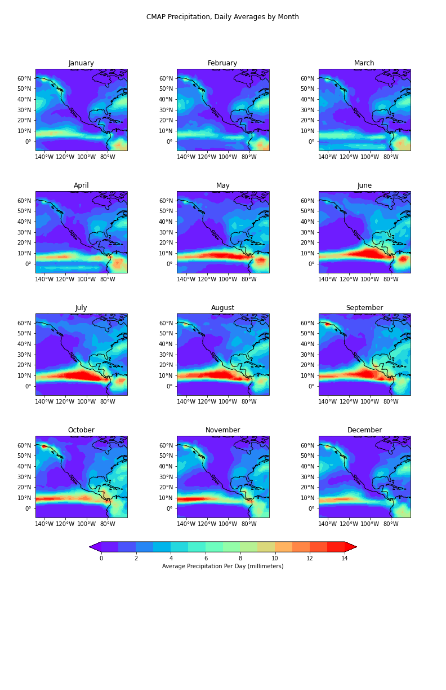

# The relationship between ENSO and ESPI climate indices and precipitation patterns

## Jake Campbell

## Introduction

My CLIM 680 project looks at the relationship between ENSO/ESPI and precipitation. This was chosen to see if there were connections between precipitation anomalies near the equator that correlated with anomalies in the Western U.S. Then, I looked at precipitation and ENSO/ESPI for Panama City, Panama, to analyze why they keep having droughts and issues running the Panama Canal. I compared to the two climate indices to see how close they correlated with each other and then looked at those individually with precipitation in one location and in the selected region.

I also started out analyzing potential vorticity for studying hurricanes but shifted to precipitation later on.

## Data

The datasets used in my project are:

__CMAP Precipitation__
The [CMAP Precipitation](https://psl.noaa.gov/data/gridded/data.cmap.html) is a precipitation data set on a 2.5x2.5 lat/lon grid. It's in NetCDF format. Lat/lons are 88.75N - 88.75S, 1.25E - 358.75E. Data is monthly averaged per day in millimeters. My selected region is located on the COLA servers in /homes/jcampb8/data-shell/thesis/enso4_1979-2018.cmap.monthly.precip.mon.mean.nc . Dates are 1979/01 to 2020/10.

__ENSO Index__
The [NOAA/OISST](https://kpegion.github.io/COLA-DATASETS-CATALOG/sst.mnmean.nc) is a SST data set on a 1.0x1.0 lat/lon grid. It's in NetCDF format. Lat/lons are 89.5N - 89.5S, 0.5E - 359.5E. Data is monthly averaged per day in °C. My selected region is located on the COLA servers in /homes/jcampb8/data-shell/thesis/nino34_1979-2018.oissttv2.nc . Dates are 1981/12 to 2020/10.

__ESPI Index__
The [ESPI](https://cmr.earthdata.nasa.gov/search/concepts/C1214428057-SCIOPS.html) is a precipitation based climate indice that correlates to ENSO. It has no lat/lon data and is taken from rectangular area around the equator - N: 10.0 S: -10.0 E: 150.0 W: 90.0, N: 10.0 S: -10.0 E: -100.0 W: 160.0. Dates are 1979-01-01 to now.

## Results and Codes

### Functions
I created a utility called clim_utils.py for doing repetitive tasks used in my analysis.
They only included:
* Define Lats and Lons for plots.

### Figures

The figures from my notebooks are saved in the "figs" subdirectory and shown in my notebooks.

### Environment

Added a .yml file to include the environment needed to run the code in my notebooks.

### Analysis and Notebooks

>[Potential Vorticity](https://github.com/Jcampbell-8/CLIM-680/blob/master/Project/code%20notebooks/Assignment1-Campbell-PV.ipynb) 

This was my first analysis, looking at the potential vorticity the day Hurricane Katrina was at its strongest. Was only used to learn how to slice an area over the Gulf of Mexico and see the very high PV of the hurricane at on instant.

>[Climatology](https://github.com/Jcampbell-8/CLIM-680/blob/master/Project/code%20notebooks/Assignment2-Campbell.ipynb) 

Average precipitation for each month of the year. Precipitation increases during the summer and decreases during the winter over the tropical regions near the equator.

>[Anomalies](https://github.com/Jcampbell-8/CLIM-680/blob/master/Project/code%20notebooks/Project-Clim%26Anomalies.ipynb) 

Precipitation anomalies shown for Panama City, Panama and my selected region (-10° to 70°,. Precipitation increases during the summer and decreases during the winter over the tropical regions near the equator. Regions of Central America show precipitation deficits for mid 1980s, and 2015-2018.

>[Nino34 Index](https://github.com/Jcampbell-8/CLIM-680/blob/master/Project/code%20notebooks/Project-Subsetting-Nino34.ipynb) 

Used groupby and subsetting to select Nino34 index for my region.

>[ESPI Index](https://github.com/Jcampbell-8/CLIM-680/blob/master/Project/code%20notebooks/Project-ConvertEspiToNETCDF.ipynb) 

Manipulated the raw ESPI index to convert string characters to integers and then convert to netCDF file to manipulate easier.

>[Composites with ESPI](https://github.com/Jcampbell-8/CLIM-680/blob/master/Project/code%20notebooks/Assignment3-Campbell.ipynb) 

Loaded in ESPI index, took precip anomalies, the composites of the anomalies to produce three plots for ESPI-Positive, ESPI-Negative, and ESPI-Neutral. Not a lot of correlation in Western US but a lot in Central America near Panema. Negative composite precipitation during ESPI-Positive-Neutral and positive composite precipitation ESPI-Negative Neutral. Or, less rain during El Nino, more rain during La Nina. Significance hatching also shown.

>[ESPI/Nino34 Comparison](https://github.com/Jcampbell-8/CLIM-680/blob/master/Project/code%20notebooks/Project-Nino%2CESPI%20comparison.ipynb) 

Loaded in both Nino34 and ESPI index. Calculated anomalies for ESPI and then plotted on same graph as Nino34. They correlated closely with a correlation coefficient of 0.778. The positive index values for ESPI trailed the positive highs of Nino34 but the negative index values stretch further negative by some ~50% than Nino34.

>[Nino34 Correlation with Significance](https://github.com/Jcampbell-8/CLIM-680/blob/master/Project/code%20notebooks/Project-Correlation-Nino.ipynb) 

Calculated anomalies for precipitation and then plotted on same graph as CMAP precipitation anomalies. Used a mask for p value of 0.05. Strong negative correlation for the equatorial Nino34 region and strong negative correlation southern Central America and Parts of South America. Also a little positive correlation cutting across the U.S.

>[ESPI Correlation with Significance](https://github.com/Jcampbell-8/CLIM-680/blob/master/Project/code%20notebooks/Project-Correlation-ESPI.ipynb) 

Used ESPI index anomalies and plotted on same graph as CMAP precipitation anomalies. Used a mask for p value of 0.05. Strong positive correlation for the equatorial Nino34 region and strong negative correlation southern Central America and Parts of South America. Also a little positive correlation cutting across the U.S. Slightly different than Nino34 correlation but all the same trends are apparent.

[ESPI Correlation](https://github.com/Jcampbell-8/CLIM-680/blob/master/Project/figs/Correlaton-ESPI%2CPrecip.png)
>[Nino34 Regression](https://github.com/Jcampbell-8/CLIM-680/blob/master/Project/code%20notebooks/Project-Regression-Nino.ipynb) 

Used Nino34 index anomalies and plotted on same graph as CMAP precipitation anomalies. Used reshape code to transform data to get m, r, and p values. Used another mask for p value of 0.05, but this time with m_array values. Similar trends as before - strong positive regression for the equatorial Nino34 region and strong negative regression southern Central America and Parts of South America. Although now there is slight negative regression over the US.

>[Nino34 Regression](https://github.com/Jcampbell-8/CLIM-680/blob/master/Project/code%20notebooks/Project-Regression-ESPI.ipynb) 

Used ESPI index anomalies and plotted on same graph as CMAP precipitation anomalies. Used reshape code to transform data to get m, r, and p values. Used another mask for p value of 0.05, but this time with m_array values. Similar trends as before - strong positive regression for the equatorial Nino34 region and strong negative regression southern Central America and Parts of South America. Although now there is slight negative regression over the US. Little difference to Nino34 regression map besides a bit stronger and more regression areas for the Nino34 comparison.

>[EOFS](https://github.com/Jcampbell-8/CLIM-680/blob/master/Project/code%20notebooks/Project-EOFs.ipynb) 

Used CMAP precipitation anomalies. Subset to my region, verified no missing values, weighted, and reshaped. It's been a few years since I've taken statistics so I'm a little fuzzy on being able to fully explain my EOF calculations and PC plots.

#### Summary

All in all I learned a huge amount with this class. At first I started off with potential vorticity data to try to analyze hurricane data. But, I then realized my best data set would be HURDATA which is tabular and we didn't learn how to use tabular data until roughly halfway into the semester. At that point I decided to look at precipitation data since it would be too late where I was to try tabular dat. I found, what seemed obscure, the ESPI index as I didn't want to use other well known ones. I was starting to find very little correlation in the Western U.S. for positive and negative ESPI values so I decided to look at the Panama Canal regions. I originally wanted to look at mainly California as my brother had to voluntarily evacuate from his California home for the wildfires with his family which was greatly effected by drought conditions. But my some of my data didn't go up to September and then I wasn't finding much correlation so I had to change regions. I chose Panama Canal area as I had done some research and recently they are worried they don't have enough freshwater to run it. They are once again in a bad drought right now. I had found during positive ESPI (El Nino) periods, there was a major precipitation deficit going on. A period in the 80s and mid 2010s to now have been the worst drought times as seen by the negative correlation with El Nino. The stronger the El Nino event, the more precipitation deficit this area will have. 

Since my ESPI index did not have any lat or lon information I was not able to better directly compare it to the Nino34 index we calculated which was a little frustrating. I was only able to do a line plot to compare them, which was still definitely interesting. Another one of my main issues was I wanted to provide more subplots instead of single plots as I think presentation would be improved. Also, I was trying to find a better colormap as I don't think the catalog og ones we have show precipitation the best. I almost tried importing one that the NWS uses but I ran out of time. I could also had done a better job of creating and writing my own functions but I think that strength will build once I get more and more programming experience.

I plan next to try out tabular data and analyze hurricane information as this is more where my passion lies. It may be the HURDATA 2 data set or another one but I'm hopeful I can apply most of the same skills I learned here to this data set.
